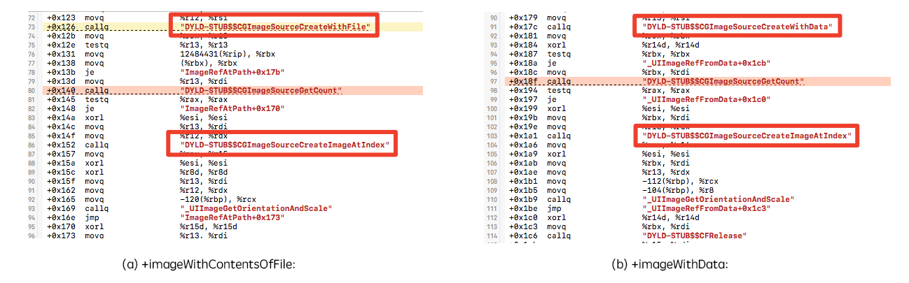
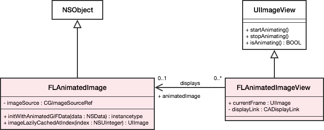
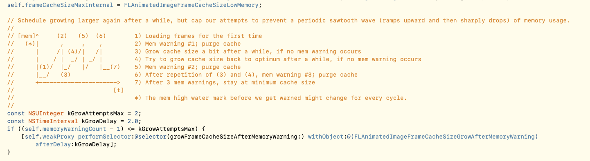

## GIF解析原理

### 引言


### 原理

在**iOS**系统中，我们通过`[UIImage imageNamed:name]`，`[UIImage imageWithData:data]`等系统api直接加载GIF图赋值给UIImageView显示时，展示的却任是一帧静态图片并不能动，所以GIF动图的显示需要我们开发者自己额外处理。

我们在开发过程中应该都接触过，系统的UIImageView提供了一个简单的做动画的方法：`[imageView setAnimationImages:]`，`[imageView setAnimationDuration:]`通过提供一个图片数组和动画时间，可以做简单的动图播放，我们经常使用这种方式做一些loading动画。那么我们是不是可以使用这种方式播放动图呢。

使用这个方法我们需要准备的数据是images图片数组和动图播放时长，首先我们已经拿到的是图片的元数据NSData(从本地或网络)，但如何通过data获取images图片数组呢？这里需要介绍一个苹果大大提供的框架：**ImageIO.framework**，一个很低调却功能强大的图像处理框架，ImageIO提供了丰富的图片处理功能，通过ImageIO甚至可以实现渐进式图片加载，下面使用一段代码演示如何使用ImageIO获取images数组：

##### ImageIO简单演示

```objective-c
// 获取imageSouce
CGImageSourceRef sourceRef = CGImageSourceCreateWithData((__bridge CFDataRef)data, NULL);
 
// 获取GIF中的图片帧数
NSInteger count = CGImageSourceGetCount(sourceRef);
 
// 加载image数组
NSMutableArray *images = [NSMutableArray arrayWithCapacity:count];
for (int i = 0; i < count; i++) {
    // 获取第i图片
    CGImageRef cgimage = CGImageSourceCreateImageAtIndex(sourceRef, i, NULL);
    [images addObject:[UIImage imageWithCGImage:cgimage]];
    CGImageRelease(cgimage);
}
 
// 为了演示代码简单易懂，这里先假设每一帧图片的播放时长都是0.1秒
CFRelease(sourceRef);
imageView.animationImages = images;
imageView.animationDuration = count * 0.1;
```

将上面的animatedImage对象赋值给UIImageView，调用startAnimating方法，动图就真的可以播放了。

#####GIF中的附加信息

那么如何获取GIF的播放时长呢？

在GIF的元数据（data）中除了图片数据，还保存了图片的一些属性。通过CGImageSourceCopyPropertiesAtIndex方法可以获取souceRef中指定帧（index）的属性，如下

```
// 每一帧的属性 
{
       ColorModel = RGB; 
       Depth = 8;
       PixelHeight = 960;
       PixelWidth = 640;
       "{GIF}" = {
       		DelayTime = "0.4";
       		UnclampedDelayTime = "0.4";
       	};
}
```

其中的DelayTime便是这一帧的播放时长。除此之外，我们还可以通过CGImageSourceCopyProperties方法获取整个GIF的信息。参数示例如下

```objective-c
{
       FileSize = 314446;
       "{GIF}" = {
           HasGlobalColorMap = 1;
           LoopCount = 0;
       };
}
```

FileSize即为GIF的大小，还有一个参数LoopCount也是非常重要的，LoopCount可以控制动图循环播放的次数。

### 思考时间❓

孔子说学而不思则罔，了解了ImageIO的使用和GIF中的附加信息之后，我们一起来思考一些问题吧。

#####思考1

使用UIImage的系统api（imageNamed:,imageWithData:）加载动图，为什么动图不会动呢？

我们可以大胆的猜测一下imageWithData:方法的内部实现，它的内部是不是也可能使用了ImageIO框架，但只获取了第一帧图片呢？



从上面这幅逆向系统API得到的调用栈图里是不是看到我们熟悉的方法`CGImageSourceCreateImageAtIndex`。

##### 思考2

使用`[UIImage animatedImageWithImages:images duration:duration]`我们可以实现简单的动图播放，但是这种方式存在什么问题呢？

* 每一帧图片的播放时长并不一定相同，系统提供的api只能设置动图总时长，不能单独设置。
* 这种方式解析GIF，需要提前将GIF中的所有的帧图片都提前创建出来，当GIF图较大时，将占用很大的内存。
* 第一次在屏幕上显示时，压缩的图像数据会在渲染时被解码成其未压缩的位图形式，这是一个非常耗费CPU的操作，因此第一次图片展示会很慢。

可见`animatedImageWithImages:duration:`这种方式还是有很多缺陷，并不适合用来直接加载GIF。

### FLAnimatedImage

当系统提供的方式再一次不能用的时候，又需要我们开发者手动来实现了。怎么来实现呢？现在我们已经可以拿到任意一帧图片和每一帧图片播放的时长了，只要能按播放时长来切换每一帧图片不就实现GIF播放了吗！只需要一个定时器控制不就可以了。思路已经有了，是不是马上就想动手（写轮子）了？然而自己写的轮子往往会是这样


所以这个时候呢，建议大家先不要直接动手，可以先去看看市面上有没有成熟的库可用，没有或者三方库不符合自己项目需求的时候再去自己开发，成熟的库经历了很多版本很多用户的检验，相对会更稳定。

SDWebImage这个框架对于iOS开发者来说可以说是家喻户晓，SD在早期的版本里也是自己来处理GIF的，但是在4.0版本之后，SD需要依赖FLAnimatedImage来专门处理GIF。所以证明FLAnimatedImage（FL == Flipboard公司）应该还是不错的，下面呢就来看一下FLAnimatedImage内部是如何实现的。

#####FLAnimatedImage的渲染流程





> FLAnimatedImage 会有两个线程同时在运转。 其中一个线程负责渲染 GIF 的每一帧的图片内容（所谓的渲染，大体上就是加载 GIF 文件数据，然后抽取出来当前需要哪一帧）。这个加载图片的过程是在异步线程进行的。 然后 FLAnimatedImage 会有一个内存区域专门放置这些渲染好的帧。 这时候，在主线程中的 ImageView 会根据当前需要，从这个内存区域中读取相应的帧。这是一个典型的 [生产者 - 消费者问题](https://en.wikipedia.org/wiki/Producer%E2%80%93consumer_problem)问题。

上面一段文字引用自FLAnimatedImage官方文档，下面简述一下渲染流程和整体结构。

1. FLAnimatedImageView（消费者）继承UIImageView，通过定时器CADisplayLink调用`setNeedsDisplay:` 触发 `displayLayer:`方法，展示当前帧图片，定时器回调时如果加载不到当前帧图片，则等待定时器下次循环（因为帧图片是异步加载）。displayLink刷新帧率是所有图片delayTime的最大公约数（为了保证每一帧的播放时长准确）。

```objective-c
- (void)displayLayer:(CALayer *)layer
{
    //修改layer的宿主来实现动图展示
    layer.contents =  (__bridge id)currentFrame.cgImage;
}
```

2. 通过重写`setImage:`，`didMoveToSuperview:` ，`didMoveToWindow:`方法启动停止定时器实现自动播放、暂停。

3. 每一帧图片都是由FLAnimatedImage对象（生产者）提供的，FLAnimatedImage内部也是使用了ImageIO的CGImageSourceCreateImageAtIndex这个api得到的，除此之外FLAnimatedImage还可以帮助我们提前解码帧图片（解码成位图）。

这里还有一个小的注意点告诉大家：

`CGImageSourceCreateWithData(CFDataRef data, CFDictionaryRef options)`，`CGImageSourceCreateImageAtIndex(CGImageSourceRef isrc, size_t index, CFDictionaryRef options)` 这两个方法的参数都有一个options，通过options参数字典可设置图片的一些属性。

下面列举两个比较重要的属性：

`kCGImageSourceShouldCacheImmediately`（BOOL）：指的是 是否*立即解码*、缓存图片，默认为NO，既解码缓存会推迟到渲染时才进行。

`kCGImageSourceShouldCache`（BOOL）：指的是解码后的图片是否进行缓存。32位系统默认为NO， 64位为YES。

在FLAnimatedImage中设置了`kCGImageSourceShouldCache=NO`，FLAnimatedImage有自己的缓存机制。

##### 缓存处理

FLAnimatedImage会根据图片的大小制定不同的缓存策略

```objective-c
// 图片大小阈值
typedef NS_ENUM(NSUInteger, FLAnimatedImageDataSizeCategory) {
    FLAnimatedImageDataSizeCategoryAll = 10,	// All frames permanently in memory (be nice to the CPU)
    FLAnimatedImageDataSizeCategoryDefault = 75,	// A frame cache of default size in memory (usually real-time performance and keeping low memory profile)
    FLAnimatedImageDataSizeCategoryOnDemand = 250,	// Only keep one frame at the time in memory (easier on memory, slowest performance)
    FLAnimatedImageDataSizeCategoryUnsupported	// Even for one frame too large, computer says no.
};

// 缓存数量
typedef NS_ENUM(NSUInteger, FLAnimatedImageFrameCacheSize) {
    FLAnimatedImageFrameCacheSizeNoLimit = 0,                // 0 means no specific limit
    FLAnimatedImageFrameCacheSizeLowMemory = 1,              // The minimum frame cache size; this will produce frames on-demand.
    FLAnimatedImageFrameCacheSizeGrowAfterMemoryWarning = 2, // If we can produce the frames faster than we consume, one frame ahead will already result in a stutter-free playback.
    FLAnimatedImageFrameCacheSizeDefault = 5                 // Build up a comfy buffer window to cope with CPU hiccups etc.
};
```

上面所指的大小指的是GIF图片解压后占用内存的大小（FLAnimatedImageDataSizeCategoryAll == 10M），简单来说就是当图片越大时，缓存的数量则会随之减少。

##### 内存警告⚠️



FLAnimatedImage中有一个全局的allAnimatedImagesWeak = [NSHashTable weakObjectsHashTable]保存所有的FLAnimatedImage对象，收到内存警告通知时会遍历所有FLAnimatedImage，调用内部的`didReceiveMemoryWarning:` 方法。

FLAnimatedImage收到内存警告后，首先会清空缓存，然后通过逐步**放开（增加）**缓存数量的方式控制内存曲线。如果我们仅仅是清空了缓存，而没有修改缓存策略，可能很短时间内内存又会暴涨成原样，而且整个内存曲线会呈现出急速下降又急速上涨的情况，看上去及其不稳定。

### 总结

GIF的展示原理其实很简单吧，通过ImageIO可以获取到帧图片和帧图片的展示时间，然后使用定时器回调更新ImageView展示的图片就可以实现GIF展示，但是有大量的工作需要放在帧图片的预加载，缓存，内存控制上。FLAnimatedImage是一个非常成熟的GIF展示库，GitHub上的star7000+，如果没有特殊需求的话，可以使用它来展示GIF，当然使用YYKit的小伙伴，可以使用YYAnimatedImageView，有兴趣的同学可以去自行了解，这里就不做介绍啦。

参考资料：

1. <https://blog.ibireme.com/2015/11/02/mobile_image_benchmark/>

2. <https://engineering.flipboard.com/2014/05/animated-gif>

3. https://github.com/Flipboard/FLAnimatedImage