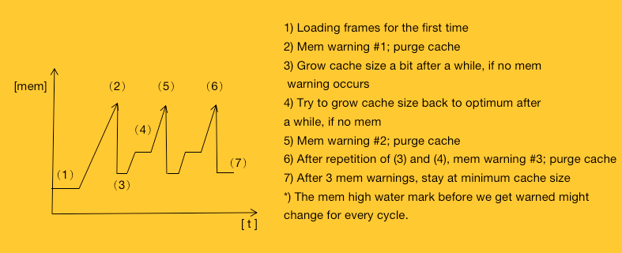

# 不了解GIF的加载原理？看我就够了！

### 引言

GIF是图片的一种压缩格式，其实就是将多张具有一定存活时间的静态图片压缩组合在了一起，在展示时将这些静态图片按照播放时长连贯播放就形成了动画。GIF也是现在使用最广泛的动图格式，应用于安卓，iOS，PC等多种平台。本文将详细的介绍GIF在iOS系统中是如何展示的，希望这篇文章能使大家更清晰的了解GIF的结构，GIF展示的原理，以及如何对内存消耗等问题进行优化。

### 核心原理

在**iOS**系统中，我们通过`[UIImage imageNamed:name]`，`[UIImage imageWithData:data]`等系统api直接加载GIF得到UIImage对象赋值给UIImageView视图显示时，展示的仍然是一帧静态图片并不能动。事实上iOS系统的控件并不支持直接展示GIF，因此GIF的展示需要我们开发者自行处理。

我们在开发过程中应该都接触过，系统的UIImageView提供了一个简单的做动画的方法：`[imageView setAnimationImages:]`，`[imageView setAnimationDuration:]`，通过提供一个图片数组和动画时间，可以做简单的动画播放，我们经常使用这种方式做一些loading动画。那么我们是不是可以使用这种方式播放GIF呢？下面我们进行一个简单的尝试。

使用这种方式我们需要准备的数据是images图片数组和动图播放时长，首先我们已经拿到了图片的元数据NSData（从本地或网络），但如何通过data得到images图片数组呢？这里需要额外介绍一个Apple提供的底层框架：**ImageIO.framework**，一个低调却功能强大的图像处理框架。ImageIO中提供了丰富的图片处理功能，通过ImageIO甚至可以实现修改exif信息，图片渐进式加载等功能，这里不一一介绍啦，下面使用一段代码演示如何使用ImageIO获取images数组：

##### ImageIO简单演示

```objective-c
 // 获取data (data也可以来自网络)
 NSString *path = [[NSBundle mainBundle] pathForResource:@"test.gif" ofType:nil];
 NSData *data = [NSData dataWithContentsOfFile:path];
    
// 获取imageSouce
CGImageSourceRef sourceRef = CGImageSourceCreateWithData((__bridge CFDataRef)data, NULL);
 
// 获取GIF中的图片帧数
NSInteger count = CGImageSourceGetCount(sourceRef);
 
// 加载image数组
NSMutableArray *images = [NSMutableArray arrayWithCapacity:count];
for (int i = 0; i < count; i++) {
    // 获取第i帧图片
    CGImageRef cgimage = CGImageSourceCreateImageAtIndex(sourceRef, i, NULL);
    [images addObject:[UIImage imageWithCGImage:cgimage]];
    
    // C函数包含create、copy、retain等时要注意手动释放
    CGImageRelease(cgimage);
}
 
// 为了演示代码简单易懂，这里先假设每一帧图片的播放时长都是0.1秒
CFRelease(sourceRef);
imageView.animationImages = images;
imageView.animationDuration = count * 0.1;
```

完成了上面的步骤之后，我们调用UIImageView的startAnimating方法，动图就可以播放了（感兴趣的同学可以手动实验一下）。

#####GIF中的附加信息

我们的GIF已经可以动起来了，但是播放时间还是不太准确，那么如何获取GIF真正的播放时长呢？

在GIF的元数据（data）中除了图片数据，还保存了图片的附加属性。通过CGImageSourceCopyPropertiesAtIndex方法可以获取souceRef中指定帧（index）的属性字典，参数如下：

```
// 每一帧的属性 
{
       ColorModel = RGB; 
       Depth = 8;
       PixelHeight = 960;
       PixelWidth = 640;
       "{GIF}" = {
       		DelayTime = "0.4";
       		UnclampedDelayTime = "0.4";
       	};
}
```

其中的DelayTime便是这一帧的播放时长。

除此之外，我们还可以通过CGImageSourceCopyProperties方法获取整个GIF的信息。参数示例如下：

```objective-c
{
       FileSize = 314446;
       "{GIF}" = {
           HasGlobalColorMap = 1;
           LoopCount = 0;
       };
}
```

FileSize即为GIF的大小，参数LoopCount也是非常重要的，LoopCount可以控制动图循环播放的次数。

获取DelayTime

```objective-c
// 获取第3帧的DelayTime 
// __bridge_transfer：c和OC桥接，并且移交内存管理权。移交之后frameProperties的内存管理就不需要我们手动控制了
NSDictionary *frameProperties = (__bridge_transfer NSDictionary *)CGImageSourceCopyPropertiesAtIndex(sourceRef, 2, NULL);

// 取对应的key
NSDictionary *gifDict = [frameProperties objectForKey:(id)kCGImagePropertyGIFDictionary];
NSNumber *number = [gifDict objectForKey:(id)kCGImagePropertyGIFUnclampedDelayTime];

// 拿到时长
double frameDuration = [number doubleValue];
```

同样的，我们获取loopCount

```objective-c
// 获取GIF的loopCount
NSDictionary *imageProperties = (__bridge_transfer NSDictionary *)CGImageSourceCopyProperties(sourceRef, NULL);

// 取对应的key
NSDictionary *gifDict = [imageProperties objectForKey:(id)kCGImagePropertyGIFDictionary]
NSNumber *number = [gifDict objectForKey:(id)kCGImagePropertyGIFLoopCount];

// 拿到循环次数
NSUInteger loopCount = [number unsignedIntegerValue];
```

这样GIF的播放时长和循环次数信息我们就都拿到了。

### 思考时间❓

通过上面的步骤我们已经实现GIF的播放了，这么简单就完事了吗？下面让我们一起来思考一些问题吧🤔

#####思考1

使用UIImage的系统api（imageNamed:，imageWithData:）加载动图，为什么动图不会动呢？

我们可以大胆的猜测一下imageWithData:方法的内部实现，它的内部是不是也可能使用了ImageIO框架，但只是获取了第一帧图片呢？


事实确实如此，从上面这幅逆向系统api得到的调用栈图里是不是看到我们熟悉的方法`CGImageSourceCreateImageAtIndex`，说明UIImage底层也是使用ImageIO处理的。

##### 思考2

使用`[imageView setAnimationImages:]`，`[imageView setAnimationDuration:]`这种方式播放GIF存在什么问题呢？

* 从GIF的附加信息中我们可以得知，每一帧图片都有自己的播放时长，所以每一帧图片的播放时长并不一定相同，系统提供的api只能设置播放总时长，却不能单独设置每帧的时长，这样可能导致有些帧的播放时长不准确。
* 使用这种方式展示GIF，需要将GIF中的所有帧图片都提前创建好，当GIF图较大时，将占用很大的内存。
* 第一次在屏幕上显示时，压缩的图像数据会在渲染时被解码成其未压缩的位图形式，这是一个非常耗费CPU的操作，因此第一次图片展示会很慢。

可见`[imageView setAnimationImages:]`这种方式还是有很多缺陷，并不适合用来直接加载GIF。这种方式不能用了，看来又需要我们自己动手实现了，怎么实现呢？

现在我们已经可以拿到任意一帧图片和每一帧的播放时长了，只要能按照播放时长来播放每一帧图片就可以了。那么怎么做到按播放时长来切换图片呢？定时器，用定时器控制不就行了。

思路有了是不是马上就想撸代码去了，写到这里，想再跟大家聊聊那个老生常谈的话题：*我们该不该重复的造轮子呢？*下面小编谈谈我自己的看法：

- 优先选择现有的活跃轮子。没有或者三方库不符合自己项目需求的时候再去自己开发，成熟的轮子经历了很多版本，很多用户的检验，相对会更加稳定。

- 初中学者不建议自己造轮子。因为经验的不足，对技术的理解不深，思考问题不够全面等，自己造的轮子往往是不可靠的。

  

  当然也不能只是把轮子拿来使用，建议初中学者要去了解轮子背后的原理，学习别人的思路，为自己积累经验。

- 有经验的大神们，可以去发现现有轮子的不足，进行优化、重构；当有足够的时间更好的思路时，可以撸一个更好的出来。

### FLAnimatedImage

那么GIF展示有没有成熟的库可用呢？下面给大家推荐一个作者项目中正在使用的：

SDWebImage这个框架对于iOS开发者来说都不陌生吧，SD在早期的版本里是自己来处理GIF的，但是在4.0版本之后，SD需要依赖FLAnimatedImage（FL == Flipboard公司）来专门处理GIF，证明FLAnimatedImage应该还是不错的，FLAnimatedImage的用法比较简单就不给大家介绍了，下面的篇幅主要看一下FLAnimatedImage内部是如何实现的。

#####FLAnimatedImage的渲染流程


> FLAnimatedImage 会有两个线程同时在运转。 其中一个线程负责渲染 GIF 的每一帧的图片内容（所谓的渲染，大体上就是加载 GIF 文件数据，然后抽取出来当前需要哪一帧）。这个加载图片的过程是在异步线程进行的。 然后 FLAnimatedImage 会有一个内存区域专门放置这些渲染好的帧。 这时候，在主线程中的 ImageView 会根据当前需要，从这个内存区域中读取相应的帧。这是一个典型的 [生产者 - 消费者问题](https://en.wikipedia.org/wiki/Producer%E2%80%93consumer_problem)问题。

上面一段文字引用自FLAnimatedImage官方文档，下面简述一下FLAnimatedImage的整体结构和渲染流程。

1. FLAnimatedImageView（消费者）继承UIImageView，通过定时器CADisplayLink调用`setNeedsDisplay:` 触发 `displayLayer:`方法切换帧图片，定时器回调时如果加载不到当前帧图片，则等待定时器下次循环（帧图片是异步加载的）。CADisplayLink刷新帧率是所有图片delayTime的最大公约数（为了保证每一帧的播放时长准确）。

   ```objective-c
   - (void)displayLayer:(CALayer *)layer
   {
       //修改layer的宿主来实现动图展示
       layer.contents =  (__bridge id)currentFrame.cgImage;
   }
   ```

2. 通过重写`setImage:`，`didMoveToSuperview:` ，`didMoveToWindow:`等方法启动停止定时器实现自动播放、暂停；同时可以通过设置定时器添加进不同的runloopMode来决定GIF在滚动列表时是否需要播放。

3. 每一帧图片都是由FLAnimatedImage对象（生产者）提供的，FLAnimatedImage内部也是使用了ImageIO的CGImageSourceCreateImageAtIndex这个api得到的，除此之外FLAnimatedImage还可以帮助我们提前解码了帧图片（解码成位图）。

Tips: 这里还有一个小的注意点告诉大家：`CGImageSourceCreateWithData(CFDataRef data, CFDictionaryRef options)`，`CGImageSourceCreateImageAtIndex(CGImageSourceRef isrc, size_t index, CFDictionaryRef options)` 这两个方法的参数都有一个options，通过options参数字典可设置图片的一些属性。

下面列举两个比较重要的属性：

`kCGImageSourceShouldCacheImmediately`（BOOL）：指的是 是否*立即解码*、缓存图片，默认为NO，既解码缓存会推迟到渲染时才进行。`kCGImageSourceShouldCache`（BOOL）：指的是解码后的图片是否进行缓存。32位系统默认为NO， 64位为YES。在FLAnimatedImage中设置了`kCGImageSourceShouldCache`为NO，FLAnimatedImage有自己的缓存机制。

##### 缓存处理

FLAnimatedImage会根据图片的大小制定不同的缓存策略

图片大小阈值

```objective-c
typedef NS_ENUM(NSUInteger, FLAnimatedImageDataSizeCategory) {
    FLAnimatedImageDataSizeCategoryAll = 10,
    FLAnimatedImageDataSizeCategoryDefault = 75,
    FLAnimatedImageDataSizeCategoryOnDemand = 250,
    FLAnimatedImageDataSizeCategoryUnsupported	// Even for one frame too large, computer says no.
};
```

缓存数量

```objective-c
typedef NS_ENUM(NSUInteger, FLAnimatedImageFrameCacheSize) {
    FLAnimatedImageFrameCacheSizeNoLimit = 0,                // 0 means no specific limit
    FLAnimatedImageFrameCacheSizeLowMemory = 1, 
    FLAnimatedImageFrameCacheSizeGrowAfterMemoryWarning = 2, 
    FLAnimatedImageFrameCacheSizeDefault = 5
};
```

上面的图片大小阈值指的是GIF图片解压成位图后占用内存的大小（FLAnimatedImageDataSizeCategoryAll == 10M）。

```objective-c
// 选择缓存模式
// 如果外部没有指定缓存数量 If no value is provided, select a default based on the GIF.
if (optimalFrameCacheSize == 0) {
    // 计算解压缩后的GIF图大小 (单张大小*可用的帧数)
    CGFloat animatedImageDataSize = CGImageGetBytesPerRow(self.posterImage.CGImage) * self.size.height * (self.frameCount - skippedFrameCount) / MEGABYTE;
    // 如果小于10M，全部缓存
    if (animatedImageDataSize <= FLAnimatedImageDataSizeCategoryAll) {
        _frameCacheSizeOptimal = self.frameCount;
    } 
    // 如果小于75M，缓存5张
    else if (animatedImageDataSize <= FLAnimatedImageDataSizeCategoryDefault) {
        _frameCacheSizeOptimal = FLAnimatedImageFrameCacheSizeDefault;
    } else {
        // 大于75m，只缓存1张
        _frameCacheSizeOptimal = FLAnimatedImageFrameCacheSizeLowMemory;
    }
} else {
    // Use the provided value. 如果外部指定了缓存数量 直接使用
    _frameCacheSizeOptimal = optimalFrameCacheSize;
}
```

简单来说缓存策略就是当图片越大时，缓存的数量则会随之减少。

##### 内存警告⚠️

FLAnimatedImage中有一个全局的allAnimatedImagesWeak = [NSHashTable weakObjectsHashTable]（弱引用哈希表）保存所有的FLAnimatedImage对象，收到内存警告通知时会遍历所有的FLAnimatedImage，调用其内部的`didReceiveMemoryWarning:` 方法。



FLAnimatedImage收到内存警告后，首先会清空缓存，然后通过逐步**放开（增加）**缓存数量的方式控制内存曲线。如果我们仅仅是清空了缓存，而没有修改缓存策略，可能在很短时间内内存又会暴涨成原样，然后内存再次被清空，整个内存曲线会呈现出急速下降又急速上涨的情况，看上去及其不稳定。

### 总结

GIF的展示原理其实并不复杂，通过ImageIO可以获取到帧图片和帧图片的展示时间，然后使用定时器刷新UIImageView展示的图片就可以实现GIF展示，但是有大量的工作需要放在帧图片的预加载，缓存，内存控制上。FLAnimatedImage是一个非常成熟的GIF展示库，GitHub上的star7000+，在流畅性、内存控制方面都做了不错的优化，如果没有特殊需求的话，可以直接使用它来展示GIF。当然有使用YYKit的小伙伴，也可以使用YYAnimatedImageView，由于篇幅的限制，这里就不做介绍啦。

参考资料

1. <https://blog.ibireme.com/2015/11/02/mobile_image_benchmark/>

2. <https://engineering.flipboard.com/2014/05/animated-gif>

3. https://github.com/Flipboard/FLAnimatedImage